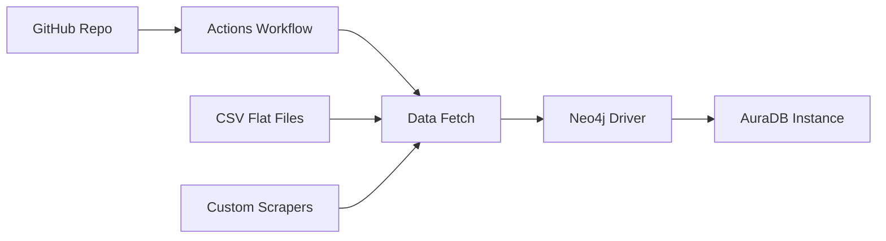

# Neo4j Aura Data Pipeline

This repository contains a data pipeline implementation for loading and managing data in **Neo4j AuraDB**, the fully managed cloud graph database service from Neo4j. 

## ✨ **Features**

- ✅ Automated data ingestion into Neo4j Aura instances using modern DevOps practices
- ✅ Integration with **GitHub Actions** for continuous data pipeline execution
- ✅ Support for **Cypher-based** data modeling and optimization

## 🛠 **Prerequisites**

| Requirement | Version | Purpose |
|-------------|---------|---------|
| Neo4j AuraDB | Free/Professional/Enterprise | Target database |
| Python | 3.8+ | Data loading scripts |
| GitHub Account | - | CI/CD workflows |

## 🚀 **Quick Start**

1. **Fork/Clone** this repository
2. **Configure GitHub Secrets**:
   ```bash
   NEO4J_AURA_URI=neo4j+s://<your-instance>.neo4j.io
   NEO4J_USERNAME=neo4j
   NEO4J_PASSWORD=<your-password>
   
3. **Enable GitHub Actions** (`.github/workflows/`)
4. **Customize** Cypher scripts (`/cypher/`) or loaders (`/scripts/`)
5. **Run** via Actions or push test data

## 🏗 **Architecture**



**Components:**

- **Data Sources**: csv files
- **Processing**: Python + neo4j-driver
- **Deployment**: GitHub Actions
