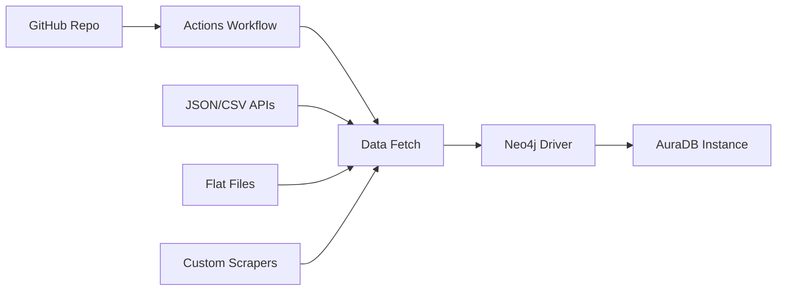

```markdown
# Neo4j Aura Data Pipeline

This repository contains a data pipeline implementation for loading and managing data in **Neo4j AuraDB**, the fully managed cloud graph database service from Neo4j. Built for cloud infrastructure automation, it leverages expertise in Terraform, Kubernetes, Python/Go, and CI/CD workflows to streamline graph data operations.[attached_file:1]

## ✨ **Features**

- ✅ Automated data ingestion into Neo4j Aura instances using modern DevOps practices
- ✅ Integration with **GitHub Actions** for continuous data pipeline execution
- ✅ Support for **Cypher-based** data modeling and optimization
- ✅ Compatible with **Azure** cloud services and infrastructure-as-code tools like Terraform
- ✅ Scalable for production workloads with monitoring and secret management[attached_file:1]

## 🛠 **Prerequisites**

| Requirement | Version | Purpose |
|-------------|---------|---------|
| Neo4j AuraDB | Free/Professional/Enterprise | Target database |
| Python | 3.8+ | Data loading scripts |
| Go | 1.20+ | Alternative runtime |
| GitHub Account | - | CI/CD workflows |
| Azure CLI | Optional | Advanced deployments |

## 🚀 **Quick Start**

1. **Fork/Clone** this repository
2. **Configure GitHub Secrets**:
   ```bash
   NEO4J_AURA_URI=neo4j+s://<your-instance>.neo4j.io
   NEO4J_USERNAME=neo4j
   NEO4J_PASSWORD=<your-password>


3. **Enable GitHub Actions** (`.github/workflows/`)
4. **Customize** Cypher scripts (`/cypher/`) or loaders (`/scripts/`)
5. **Run** via Actions or push test data

## 🏗 **Architecture**



**Components:**

- **Data Sources**: APIs, files, scrapers
- **Processing**: Python/Go + neo4j-driver
- **Deployment**: GitHub Actions or Kubernetes
- **Visualization**: Neo4j Bloom + Appsmith


## 💻 **Usage Examples**

### **Python Data Loader**

```python
from neo4j import GraphDatabase

driver = GraphDatabase.driver(URI, auth=(USERNAME, PASSWORD))

def load_person(tx, name):
    tx.run("CREATE (p:Person {name: $name})", name=name)

with driver.session() as session:
    session.execute_write(load_person, "John Doe")

driver.close()
```


### **Cypher Query Optimization**

```cypher
// Use EXPLAIN/PROFILE for tuning
EXPLAIN 
MATCH (p:Person)-[:WORKS_AT]->(c:Company)
RETURN p.name, c.name
ORDER BY p.name;
```


## 🤝 **Contributing**

1. **Fork** the repo
2. **Create feature branch** (`git checkout -b feature/amazing-feature`)
3. **Commit changes** (`git commit -m 'Add amazing feature'`)
4. **Push** (`git push origin feature/amazing-feature`)
5. **Open Pull Request**

**Focus areas:**

- CI/CD pipeline enhancements
- Performance optimizations
- Kubernetes Helm charts
- Data source connectors
```
